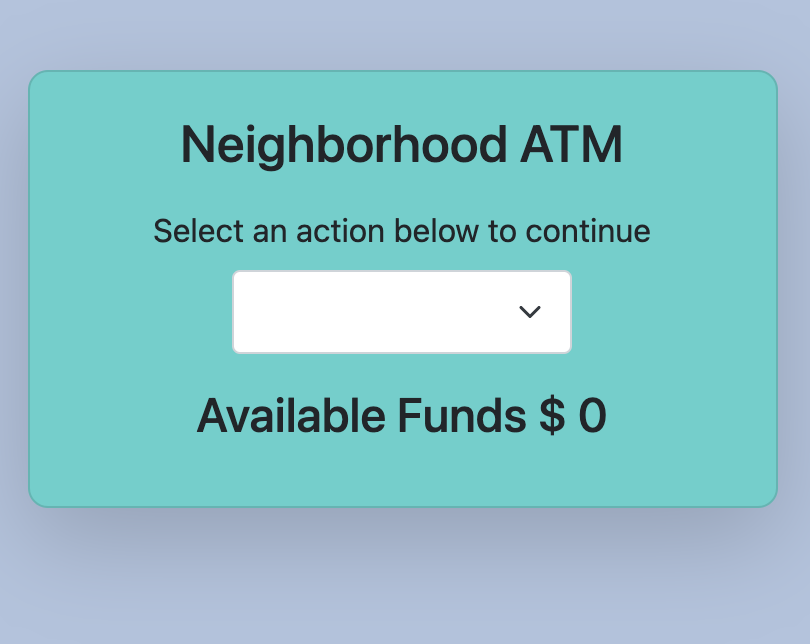
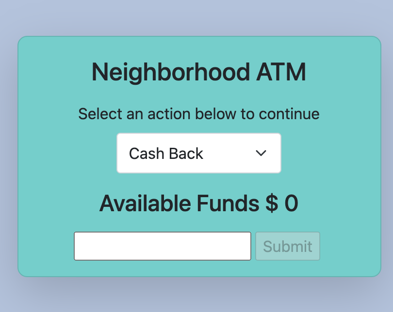
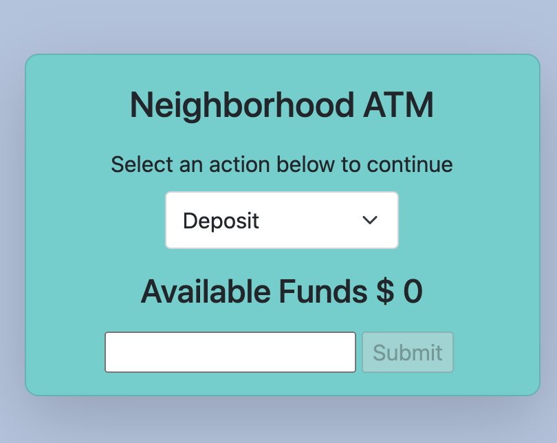

# ATM-Machine
Deposit and Withdraw funds from an Account with React

This is the code for a basic ATM Machine made with React. It originated from an assignment in Week #15 of MIT's MERN Coding Bootcamp. The challenge was to add select components for Deposit or withdrawals, hide input until deposit or withdrawal is selected, validate input so withdrawals exceeding account values disables the submit button, refractor, personalize features, and add styling.

<h2>Features</h2>
<ol>
<li>React useState is used to maintain state of the list and input values for new items.</li>
<li>Select options added for Deposits or Withdrawals.</li>
<li>Amount Input field disabled until Deposit or Withdrawal is selected.</li>
<li>Input field is cleared after each transaction.</li>
<li>Input and submit components refractored from app.js</li>
  <li>Withdrawals exceeding the account balance are disabled.</li>
</ol>

<h2>To see the ATM Machine in action follow this link:</h2>
<a href="https://codesandbox.io/s/atm-machine-e50nn">Link to CodeSandbox</a>
<h2>To use:</h2>
<ul>
<li>Fork this repository</li>
<li>Clone copy to your desktop</li>
<li>Open a command line on your computer and run the command cd path/to/project/root. (path/to/project/root should be replaced with the actual path to the project folder)</li>
<li>Within the same command-line window, run 'npm install' to install all dependencies.</li>
<li>Within the same command-line window, run 'npm start' to start the application in your browser.</li>
  </ul>
<h2>Contributors</h2>
<ul>
  <li>Bill Conley</li>
  <li>Dr. John Williams</li>
 </ul>
<h2>License</h2>

Copyright (c) 2021 Bill Conley

Permission is hereby granted, free of charge, to any person obtaining a copy
of this software and associated documentation files (the "Software"), to deal
in the Software without restriction, including without limitation the rights
to use, copy, modify, merge, publish, distribute, sublicense, and/or sell
copies of the Software, and to permit persons to whom the Software is
furnished to do so, subject to the following conditions:

The above copyright notice and this permission notice shall be included in all
copies or substantial portions of the Software. 

THE SOFTWARE IS PROVIDED "AS IS", WITHOUT WARRANTY OF ANY KIND, EXPRESS OR
IMPLIED, INCLUDING BUT NOT LIMITED TO THE WARRANTIES OF MERCHANTABILITY,
FITNESS FOR A PARTICULAR PURPOSE AND NONINFRINGEMENT. IN NO EVENT SHALL THE
AUTHORS OR COPYRIGHT HOLDERS BE LIABLE FOR ANY CLAIM, DAMAGES OR OTHER
LIABILITY, WHETHER IN AN ACTION OF CONTRACT, TORT OR OTHERWISE, ARISING FROM,
OUT OF OR IN CONNECTION WITH THE SOFTWARE OR THE USE OR OTHER DEALINGS IN THE
SOFTWARE.

